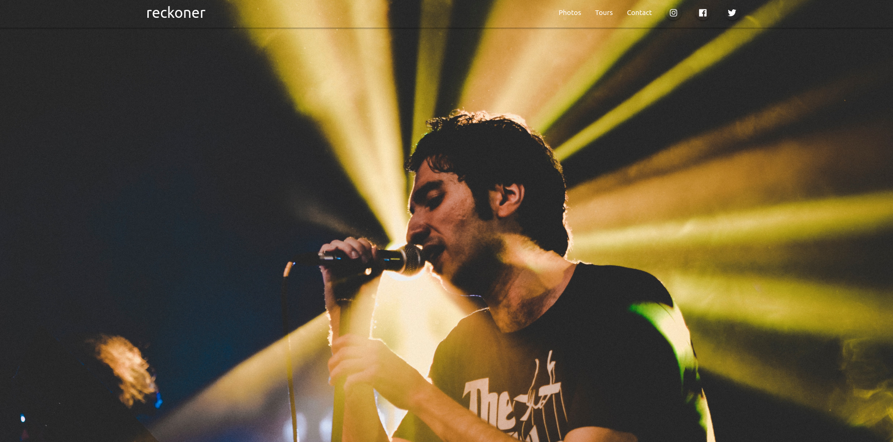

# Artist Landing Page
The challenge is to make an artist landing page using Materialize CSS.

## Table of contents

 - [The challenge](#the-challenge)
  - [Screenshot](#screenshot)
- [My process](#my-process)
  - [Built with](#built-with)
  - [What I learned](#what-i-learned)
- [Acknowledgments](#acknowledgments)

### The challenge

Create a fully responsive artist landing page. Execute with Materialize CSS and jQuery

### Screenshot

## My process
I laid out the HTML and the CSS integration was seemless. The grid based system of Materialize was smooth to integrate and easily created the  website, cutting down my mock-up creation time by half.

### Built with

- Semantic HTML5 markup
- CSS custom properties
- Materialize CSS
- Mobile-first workflow
- [jQuery](https://jquery.com/) - JS library

### What I learned

I wanted to create a template website using Materialize CSS

## Acknowledgments

I want to thank Net Ninja for his amazing youtube series on Materialize. 
https://www.youtube.com/playlist?list=PL4cUxeGkcC9gGrbtvASEZSlFEYBnPkmff
